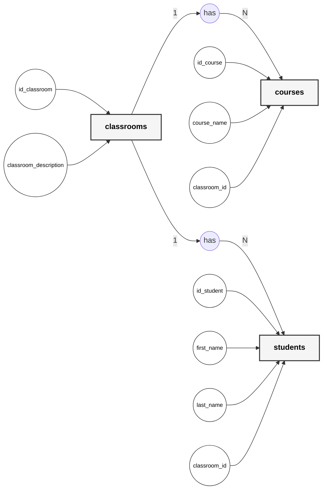
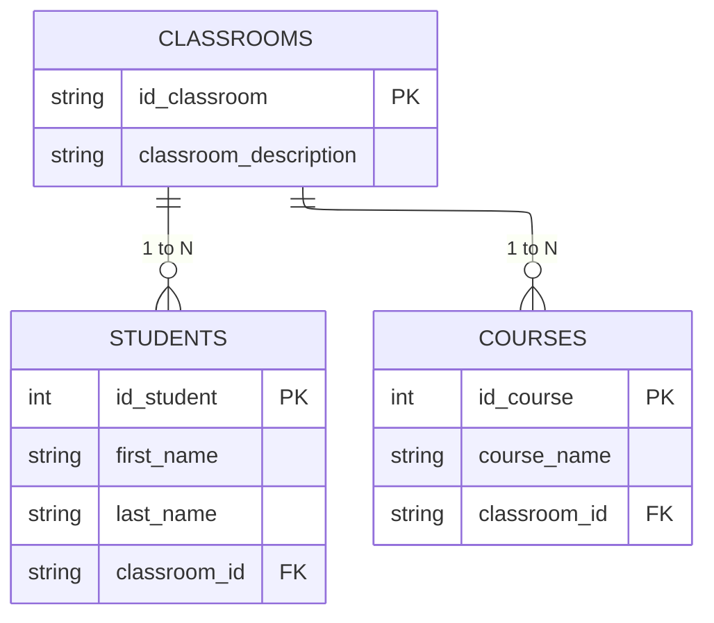

# students-classrooms-courses-simoneaa
1er ejercicio de normalización de bases de datos

## Descripción

En este ejercicio se nos pedía normalizar los datos de una tabla proporcionada empleando las 3 Normas Formales. La tabla proporcionada era la siguiente:

## Normalización de la tabla

Empleando Google Sheets, dividí la tabla proporcionada en tres diferentes, con "classrooms" siendo la principal y conteniendo "students" y "courses". La clave primaria "id_classroom" es la clave foránea que relaciona las otras dos tablas con la principal y entre ellas.

## Diagrama de Chen

## Diagrama de patas de gallo

